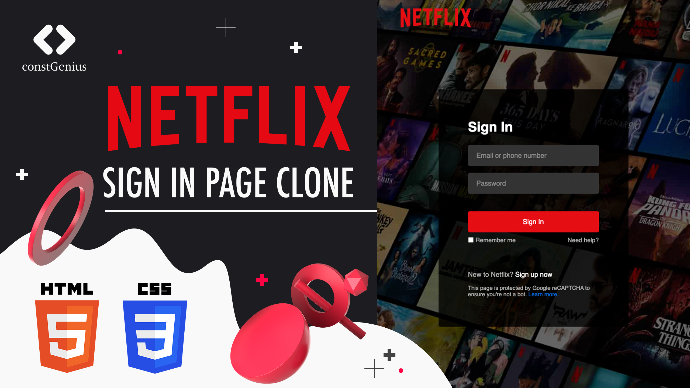

# Netflix Sign-In Page Clone Using HTML CSS

This project is a Netflix sign-in page clone created using HTML and CSS. It aims to replicate the appearance and functionality of the Netflix sign-in page, allowing users to practice front-end web development skills while learning how to create a visually appealing user interface.

